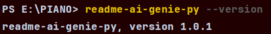
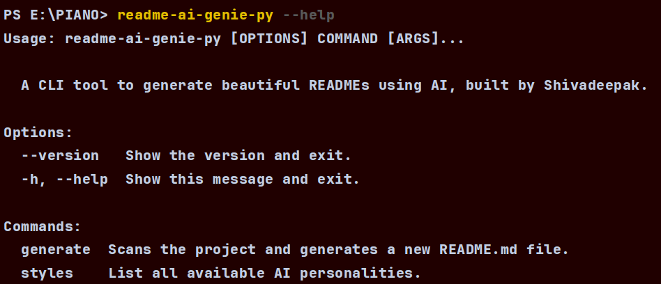
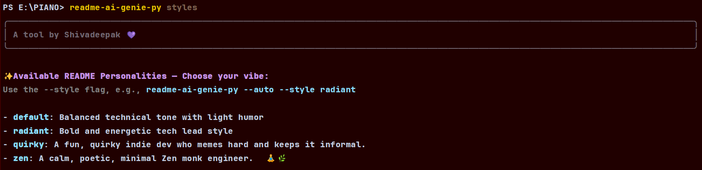
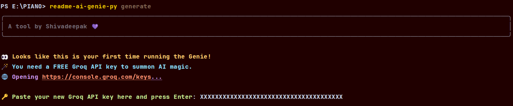
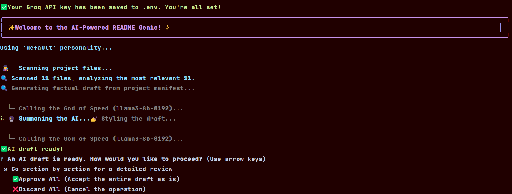
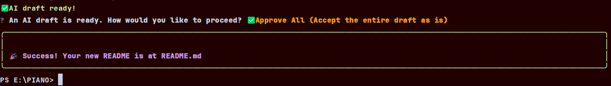

# 🧞‍♂️ readme-ai-genie (Python Edition) 🐍✨

[](https://pypi.org/project/readme-ai-genie-py/)
[](LICENSE)
[](https://github.com/shivadeepak99/readme-ai-genie-py/releases)


> **Your project’s personal AI stylist for killer documentation.**  
> 🪄 From skeleton code to storybook-ready—let our AI genie craft and style your README like a pro, powered by **Groq's blazing-fast LLMs**.

 It's a smart CLI tool that uses a two-step AI pipeline with **Groq** to generate beautiful, personality-driven documentation for any project.This will improve as time passes...

---


### ✨ What This Genie Does

* **Scans your project** (and smartly ignores junk in your `.gitignore`).
* **Uses Groq API** to generate a clean, factual README draft.
* **Styles it up** with emojis, a unique personality, and professional formatting.
* **Lets you review, edit, and approve** every section before saving.

---

## 🚀 Installation & Setup

1.  **Install from PyPI:**
    ```bash
    pip install readme-ai-genie-py
    ```

2.  **API Key Configuration:**
    The very first time you run the tool, it will detect that you don't have a Groq API key.
    
    * It will automatically open your browser to the [Groq Developer Console](https://console.groq.com/).
    * It will then prompt you to paste the key directly into your terminal.
    * It will create a `.env` file in your project root and securely save the key for all future uses.

    > **🔐 Security Note:** Your API key is stored locally in a `.env` file in your project's root directory. It is **never** sent anywhere except directly to Groq's API for README generation.

---

## 💻 Usage & Commands

All commands are run from the root of the project you want to document.
### 📌 Version Check


### 💁 Help Command


### 🎨 Style List


### ⚙️ Setup Prompt (API Key)

### ✨ Generate README


### Readme Saved !



###  This is the exact readme generated after i did the above for a simple piano project
<details>
  <summary><strong>📂 Sample Embedded README: "Code the Beat"</strong></summary>

<br>

**Project Title** 🔥 "Code the Beat"  
---

**Badges**  
[](https://pypi.org/project/None/)  
[](LICENSE)  

## Tech Stack 📊  
* HTML  
* CSS  
* JavaScript (jQuery)  
* Web Audio API  

## Features 🎵  
* Interactive keyboard using standard keyboard keys (A, S, D, F, G, H, J, K, L, 😉)  
* Plays corresponding audio notes on key press.  
* Visually appealing neon-styled keys.  
* Responsive design adapting to different screen sizes.  

## Installation 💻  
This project is entirely client-side and requires no server-side shenanigans. To rock it locally:  
1. Download the project files.  
2. Open `index.html` in your favorite web browser. *(Chrome recommended for optimal audio bliss.)*  

## Usage 🎸  
Press the keys A, S, D, F, G, H, J, K, L, and 😉 to play the notes.  
Each key triggers a unique audio file. Experiment and find your groove!  

## How It Works 💻  
The app uses JavaScript and jQuery to listen for key presses. When a key is pressed:  
1. The JavaScript code identifies the key code.  
2. jQuery selects the corresponding audio element.  
3. The associated audio file plays.  

```mermaid
graph TD
    A[Key Press Event] --> B{Identify Key Code};
    B --> C[jQuery Selector];
    C --> D{Find Corresponding Audio Element};
    D --> E[Play Audio];
    E --> F[Visual Feedback (Optional)];
```

## Contributing 🤝
Contributions are most welcome! Fork the repo and submit pull requests.  
Before you contribute, please familiarize yourself with our coding style (if defined).  
A clear description of your changes is essential for a smooth PR process.

## License 📝
This project is licensed under the MIT License – see the LICENSE file for details.

> "Any fool can write code that a computer can understand. Good programmers write code that humans can understand."  
> — Martin Fowler


</details> 
---

### 📖 Full Command Cheatsheet

| Command                                    | Alias | Description |
|--------------------------------------------| --- | --- |
| `readme-ai-genie-py  generate`             |  | The main command to generate a README automatically. |
| `readme-ai-genie-py  generate <stylename>` |  | Applies a specific personality (e.g., `radiant`, `zen`). |
| `readme-ai-genie-py  styles`               |  | Lists all available AI personalities. |


---


####  As of Now We are using free api calls  , in Future if This Project Gets Support  This will generate  advanced and cool Readme ✅

---
## 🤝 Contributing
Your ideas make this genie even more magical! ✨ Contributions are welcome. Fork the repo, create a branch, and open a PR. Please review our (soon-to-be-written) `CONTRIBUTING.md` and `CODE_OF_CONDUCT.md`.

---
## 📜 License
MIT License © 2025 Shivadeepak

---
## 🧠 Dev Quote
> “First, solve the problem. Then, write the code. Finally, let the genie write the README.”
